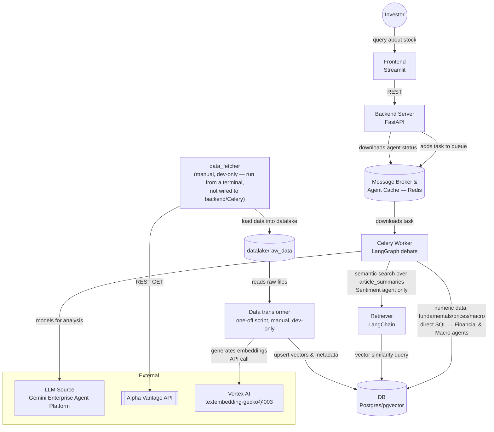
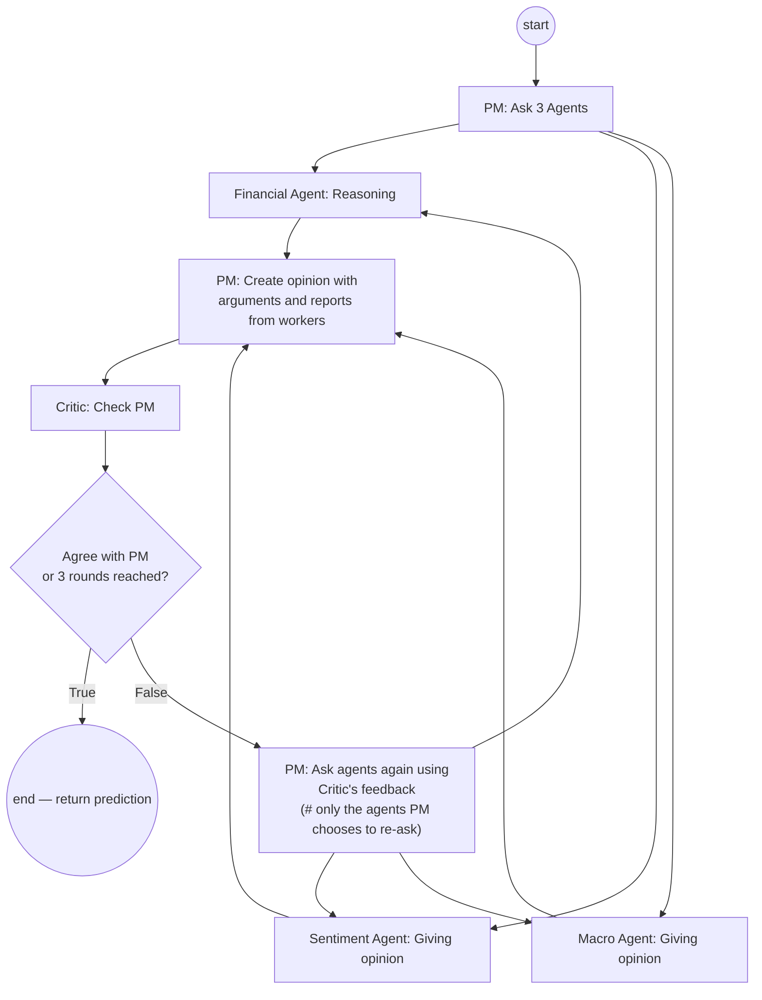

# Architecture

## 1. System overview



**Note — resolved discrepancy:** the original sketch labeled the data
transformer a "Celery Worker". Per `CLAUDE.md`'s critical rules, this is
intentionally **not** a Celery task — it's a plain script, run manually:
`python -m src.transformer.transform --tickers AAPL,TSLA`. The only Celery
worker in the system runs the LangGraph debate (`src/worker/celery_app.py`).
The diagram above reflects the corrected version.

**Note — data ingestion is manual/dev-only, by design:** there is no API
endpoint or scheduled job that refreshes the datalake. `data_fetcher`
(`data_scripts/alpha_vantage_fetcher.py` and friends) and the transformer are
both run by hand from a terminal when a developer decides to pull new data.
The backend never triggers either of them. This is a deliberate scope cut,
not a gap — see `docs/evaluation.md` for why an automatic/scheduled fetch
would also complicate point-in-time correctness for backtesting.

**Note — why two DB access paths:** the Financial and Macro agents only need
exact numeric lookups (a fiscal quarter's balance sheet, a closing price, a
FRED series value) — a plain SQL query against `fundamentals` /
`stock_prices` / `macro_series` is simpler and more precise than a
similarity search for that. The Retriever/pgvector semantic-search path
exists only for the Sentiment agent, which needs to find the news articles
*relevant* to a ticker/question out of free-text `article_summaries` —
that's the one case where embeddings genuinely earn their complexity.

## 2. Components

| Component | Responsibility | Code | Status |
| --- | --- | --- | --- |
| Frontend | Streamlit UI, talks to backend over REST | `frontend/app.py` | scaffold (empty) |
| Backend Server | FastAPI, 3 REST endpoints (§4) | `src/api/v1/` | scaffold (empty) |
| Message Broker & Agent Cache | Redis — Celery broker/backend + live debate/agent status | `src/cache/` | not started |
| Celery Worker | Runs the LangGraph debate, the only Celery worker in the system | `src/worker/` | scaffold (`test_task` only) |
| Agents (graph) | PM, Critic, Financial/Sentiment/Macro agents, debate protocol | `src/agents/` | scaffold (empty) — see `docs/agents.md` for the protocol spec |
| Retriever | LangChain semantic search over pgvector — Sentiment agent only | `src/retriever/` | scaffold (empty) |
| Data transformer | One-off script, manual/dev-only: raw files → embeddings → pgvector upsert | `src/transformer/` | scaffold (empty) |
| DB (Postgres/pgvector) | Relational storage + vector store; Financial/Macro agents query it directly via SQL | `src/db/` | **done, tested** (`tests/unit/test_db_loaders.py`) |
| data_fetcher | Fetches market/fundamental/sentiment data from Alpha Vantage into the datalake — manual/dev-only, never triggered by the backend | `data_scripts/` | done (one-off CLI scripts) |
| datalake/raw_data | External repo, read-only from this repo's POV | `../datalake/` (sibling repo) | populated for ~9-10 tickers |
| LLM Source | Gemini Enterprise Agent Platform | `src/agents/llm_client.py` | scaffold (empty) |
| Embeddings | Vertex AI `textembedding-gecko@003` | `src/retriever/embeddings.py` (not yet created) | not started |

## 3. Debate protocol (per-request flow)

Full protocol rules (round limit, termination condition, prompt loading) are
in `docs/agents.md`. Diagram view of the same flow:



## 4. REST API contract

| Method | Path | Purpose |
| --- | --- | --- |
| `POST` | `/api/v1/predict/start` | Enqueue a debate. Body: `{"ticker": "TSLA", "horizon": "1W"}` → returns `task_id` |
| `GET` | `/api/v1/predict/result/{task_id}` | Poll/fetch the final prediction (§5) |
| `GET` | `/api/v1/debate_status/{debate_id}` | Live status of an in-progress debate (round number, which agents are active) |
| `GET` | `/api/v1/history/{task_id}` | Full historical transcript of a past debate |

Data ingestion has no endpoint by design (see note in §1) — a developer runs
`data_scripts/*` and the transformer manually.

## 5. Prediction output contract

This was previously undefined — nothing in the repo specified what
`/predict/result` actually returns, which blocks writing `schemas.py` and the
agent nodes. Proposed shape (Pydantic pair per CLAUDE.md convention:
`PredictResultResponse` in `src/api/v1/schemas.py`):

```jsonc
{
  "task_id": "c3f1...",
  "ticker": "TSLA",
  "horizon": "1W",
  "status": "DONE",              // PENDING | RUNNING | DONE | FAILED
  "as_of_date": "2024-03-15",    // point-in-time anchor — see docs/evaluation.md, critical for backtesting
  "model_version": "gemini-1.5-pro-002",  // exact LLM version used, for reproducibility
  "result": {
    "direction": "BUY",          // BUY | HOLD | SELL — the only three allowed values
    "confidence": 0.72,          // 0.0-1.0, PM's self-reported confidence
    "summary": "...",            // PM's final synthesized rationale
    "rounds_used": 2,            // 1-3
    "critic_agreed": true,
    "agent_reports": {
      "financial": {"opinion": "...", "reasoning": "..."},
      "sentiment": {"opinion": "...", "reasoning": "..."},
      "macro":     {"opinion": "...", "reasoning": "..."}
    }
  },
  "created_at": "2024-03-15T10:00:00Z",
  "finished_at": "2024-03-15T10:02:31Z"
}
```

Why `direction` is restricted to exactly `BUY | HOLD | SELL` (no price
target): a target price implies a regression task with its own error metric
(MAE/RMSE against actual price), which is a different and harder claim than
directional classification. Keeping the contract to direction + confidence
keeps the thesis evaluation tractable — see `docs/evaluation.md`. Revisit
this if the thesis scope explicitly requires price targets.

`as_of_date` and `model_version` are not cosmetic — both are required inputs
to the backtest methodology in `docs/evaluation.md`.

## Related docs

- `docs/agents.md` — full debate protocol (round limit, termination rule)
- `docs/evaluation.md` — backtesting methodology, network-isolation design,
  metrics
- `docs/project_decisions.md` — decision log (currently empty, needs content
  or should be replaced by `docs/adr/`)
