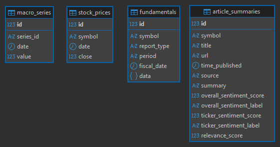

# Database layer (`src/db/`)

Loads the raw JSON/CSV files from the datalake into Postgres and exposes the
SQLAlchemy models used by the rest of the system.

## Modules

| File          | Responsibility                                                     |
| ------------- | ------------------------------------------------------------------ |
| `base.py`     | Declarative `Base` (SQLAlchemy 2.0).                               |
| `session.py`  | `engine` + `SessionLocal`, read from `DATABASE_URL`.               |
| `models.py`   | ORM models / table definitions (see below).                        |
| `init_db.py`  | Creates the schema (`Base.metadata.create_all`).                   |
| `loaders.py`  | Pure `clean_*`/`parse_*`/`iter_*` helpers + idempotent `load_*`.   |
| `load.py`     | CLI entry point (`python -m src.db.load`).                          |

## Tables

| Table               | Source (in `datalake/raw_data/`)                     | Shape                                                                 |
| ------------------- | ---------------------------------------------------- | -------------------------------------------------------------------- |
| `fundamentals`      | `BALANCE_SHEET/`, `CASH_FLOW/`, `INCOME_STATEMENT/`  | Hybrid: `symbol, report_type, period, fiscal_date` + full report in a `JSONB` `data` column. |
| `stock_prices`      | `stock_price/*_daily.json`                           | `symbol, date, close`                                                |
| `article_summaries` | `ARTICLE_SUMMARIES/*.json`                           | `symbol, url, title, source, time_published` + sentiment scores      |
| `macro_series`      | `FRED_MACRO/*.csv`                                   | `series_id, date, value`                                             |



### Why JSONB for `fundamentals`

One row = one report (one quarter for one ticker). The financial statements
have ~40 columns that differ between the three report types and are often
missing (`"None"` in the source). Instead of a wide, brittle table, the whole
report is stored in the `data` JSONB column, with only the query keys promoted
to real columns. During loading, `"None"` becomes `NULL` and numeric strings
are converted to numbers, so JSONB queries work directly:

```sql
SELECT symbol, fiscal_date, (data->>'totalAssets')::numeric AS total_assets
FROM fundamentals
WHERE report_type = 'BALANCE_SHEET' AND symbol = 'AAPL'
ORDER BY fiscal_date DESC;
```

## Connecting to the database

The data lives inside the Postgres container, in the Docker named volume
`postgres_data` (see `docker-compose.yaml`) — not in any file you browse in the
explorer. You reach it over a SQL connection on `localhost:5432`. The container
must be running: `docker compose up -d postgres`.

Connection settings (from `docker-compose.yaml`):

| Field    | Value       |
| -------- | ----------- |
| Host     | `localhost` |
| Port     | `5432`      |
| User     | `user`      |
| Password | `password`  |
| Database | `mas_db`    |

### VS Code — PostgreSQL extension

1. Open the PostgreSQL panel (or `Ctrl+Shift+P` → "PostgreSQL: Add Connection").
2. Fill in: Server name `localhost`, User name `user`, Password `password`,
   Database name `mas_db`, Connection name any label (e.g. `MAS local`).
   Port defaults to `5432`; disable SSL/Encrypt for the local container.
3. Expand `mas_db → Schemas → public → Tables` to browse the four tables.
   Right-click a table to preview rows, or open a new query editor.

### psql (terminal)

```bash
docker compose exec postgres psql -U user -d mas_db -c "\dt"
docker compose exec postgres psql -U user -d mas_db -c "SELECT * FROM stock_prices LIMIT 5;"
```

The tables appear only after `python -m src.db.load` (or `python -m src.db.init_db`)
has been run; before that `mas_db` exists but is empty.

## Loading

All loaders are **idempotent** (Postgres `ON CONFLICT DO UPDATE`), so re-running
them updates existing rows instead of creating duplicates. The datalake is
treated as read-only. The `deprecated/` directory is skipped.

See the repository `README.md` for the step-by-step run instructions.
